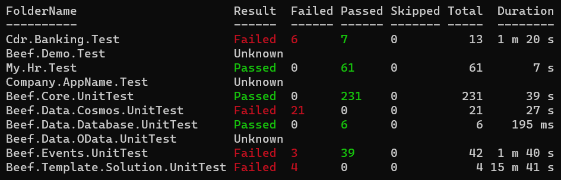

# DotNet Scripts

----
## Vulnerable Packages
Powershell script to check nuget packages used in project for know vulnerabilities that have been reported to nuget.org.

----
## Run Tests

PowerShell script for running all test projects in a given folder or child folder. Once execution is completed a test summary is displayed.

